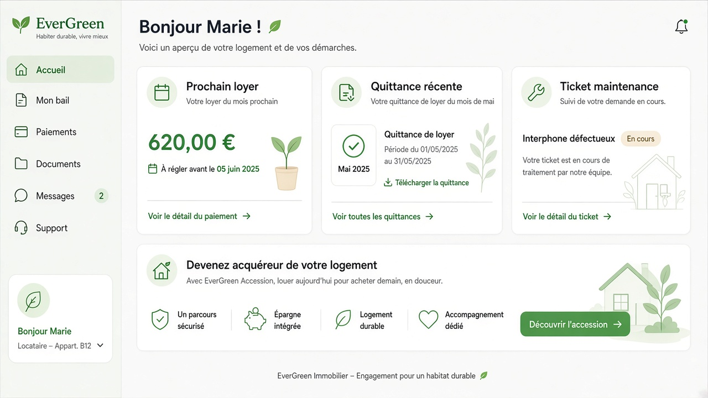

# Persona — Client (`client`)

**Mission :** suivre bail / échéancier / quittances / tickets — Vague **V3**.  
**Shell :** `/espace/client`

## Dashboard

**Widgets :** prochain loyer · dernière quittance · ticket maintenance · message agent · soft accession.

## Reports ❌

Pas de module Rapports dédié. Quittances / historique paiements = **documents** dans le dashboard (pas d’export analytique Y1).
