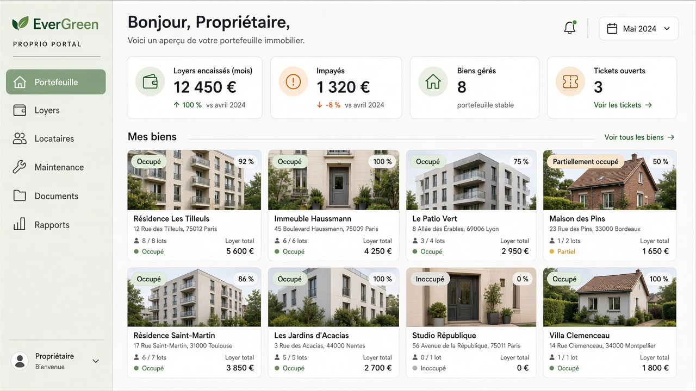
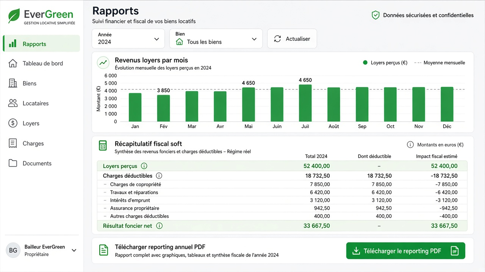

# Persona — Propriétaire / bailleur (`landlord`)

**Mission :** suivre biens gérés, loyers, maintenance — Vague **V3**.  
**Shell :** `/espace/proprio`

## Dashboard

**Widgets :** loyers encaissés · impayés · biens gérés · tickets · mini-cards portefeuille.

## Reports ✅

**Contenu :** revenus mensuels · récap fiscal soft · PDF reporting annuel · filtre par bien.
