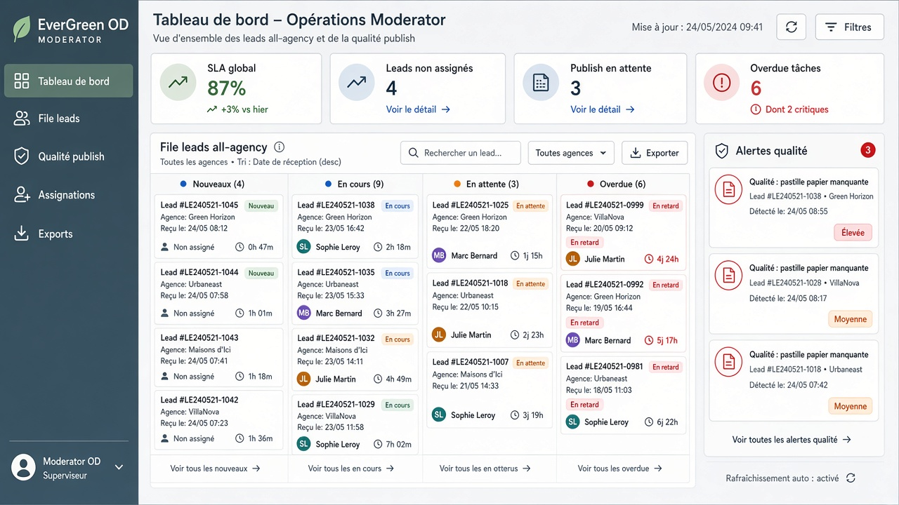
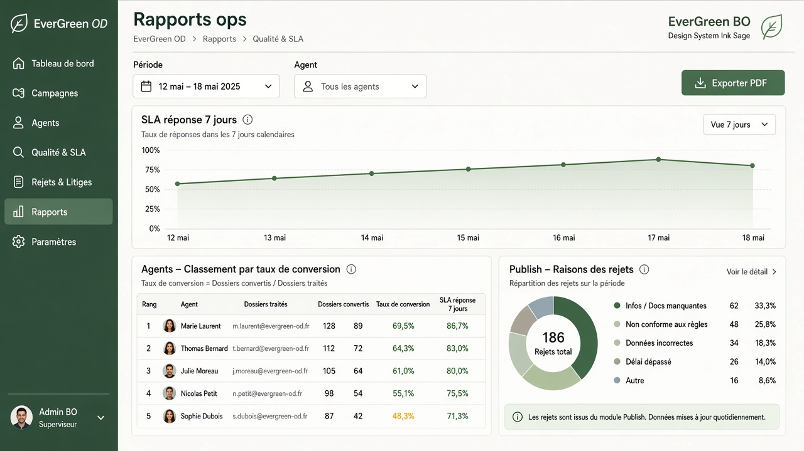

# Persona — Modérateur / OD (`moderator`)

**Mission :** qualité catalogue, SLA, assignations, exceptions publish — scope **all**.  
**Shell :** `/espace/agent` (+ modules OD)

## Dashboard

**Widgets :** SLA global · leads non assignés · publish en attente · overdue · file multi-agents · alertes qualité (pastille papier…).

## Reports ✅

**Contenu :** courbe SLA · ranking agents · motifs reject publish · export PDF/CSV.
