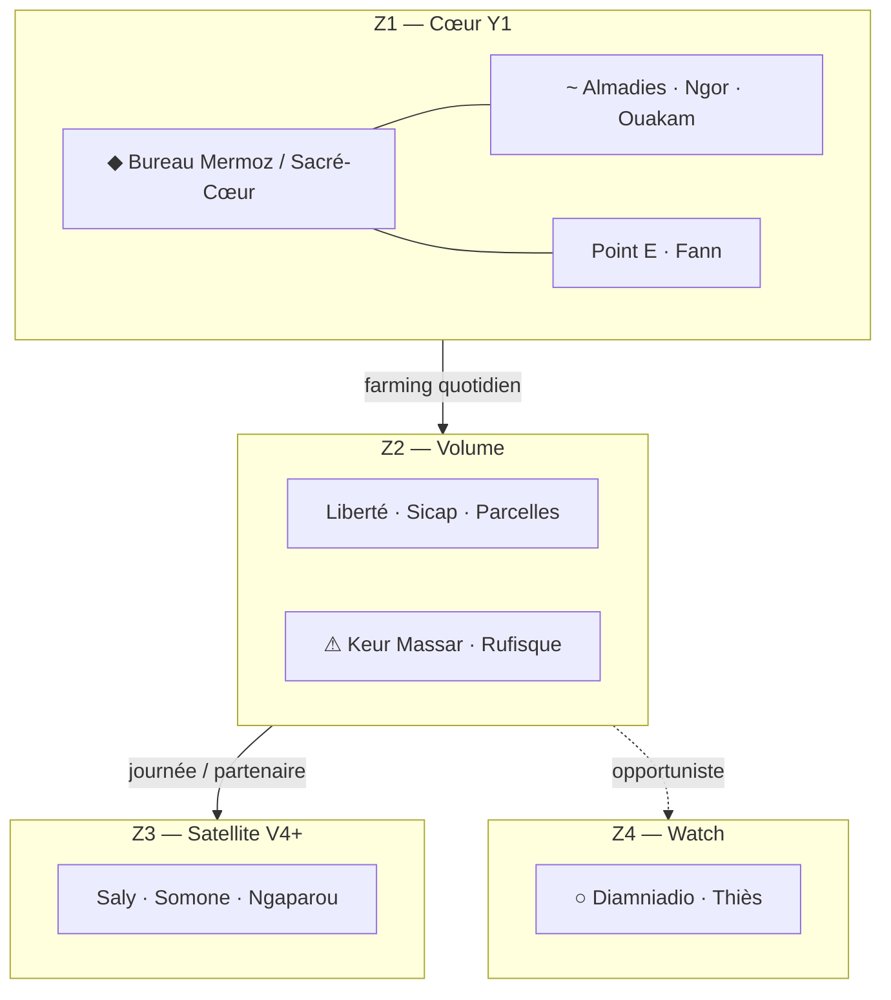

# Carte synthèse — Dakar ouest → Petite Côte

**Document :** Annexes · Cartes · 02  
**Échelle :** régionale (schéma)

---

## 1. Vue Nord → Sud (ASCII)

```
                         ▲ N
                         │
                    ATLANTIQUE
         ┌───────────────────────────────┐
         │  ~ Ngor · Almadies · Ouakam   │  Z1 littoral ★★★
         │  ~ Yoff (sélectif)            │
         │                               │
         │  Point E · Fann · Mamelles    │  Z1 bourgeois ★★★
         │  ◆ Mermoz · Sacré-Cœur        │  Z1 ops / HQ ★★★
         └───────────────┬───────────────┘
                         │
         ┌───────────────┴───────────────┐
         │  Liberté · Sicap · Parcelles  │  Z2 intermédiaire ★★
         │  Grand Yoff (sélectif)        │
         └───────────────┬───────────────┘
                         │
         ┌───────────────┴───────────────┐
         │  ⚠ Keur Massar · Jaxaay       │  Z2 accession ★★
         │  Rufisque · Bargny            │
         │  ○ Diamniadio (Z4 watch)      │
         └───────────────┬───────────────┘
                         │
              ═══ autoroute / TER ═══
                         │
         ┌───────────────┴───────────────┐
         │  Saly · Ngaparou · Somone     │  Z3 Petite Côte ★
         │  ⚠ axe Sindia–Diass (GC/NG)   │
         │  Mbour (faible Y1)            │
         └───────────────────────────────┘
                         │
                         ▼ S (Thiès ○ Z4)
```

---

## 2. Diagramme relationnel



---

## 3. Allocation effort Y1 (rappel)

| Tier | Temps / stock cible |
| --- | ---: |
| Z1 | **50–70 %** |
| Z2 | **25–35 %** |
| Z3 | **&lt; 15 %** CA |
| Z4 | Opportuniste |

---

## 4. Lien Google My Maps (à remplir)

| | |
| --- | --- |
| **URL carte live** | _À créer — calques Z1/Z2/Z3/NG_ |
| **Owner** | CT / GER |
| **Export** | KML optionnel dans ce dossier |

---

*Carte synthèse v1.0 — sept. 2026.*
