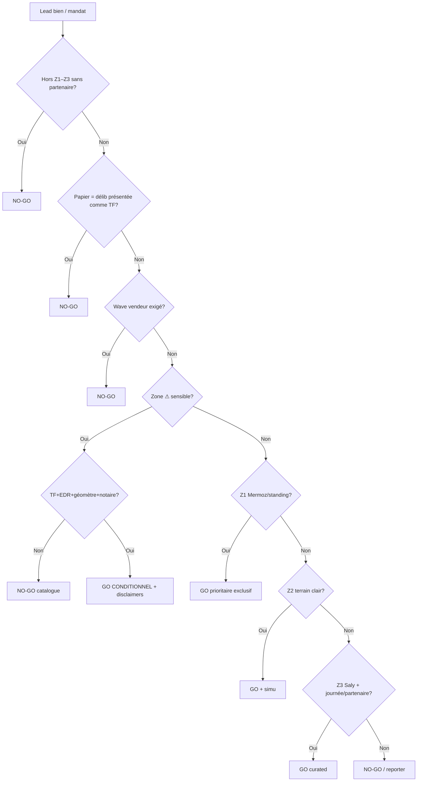

# Carte no-go & go conditionnel

**Document :** Annexes · Cartes · 06  
**Rôle :** réputation > commission · filtre catalogue

---

## 1. Carte « zones sensibles signalées »

*Pas un interdit géographique absolu — densité de plaintes / contentieux à croiser veille (`06` parcours foncier).*

```
  DAKAR OUEST (Z1)          — vigilance ~ littoral seulement

  COURONNE
    ⚠ Keur Massar (inondation / périphéries)
    ⚠ Rufisque / Kounoune
    ⚠ Dougar / abords Diamniadio (faux titres signalés)
    ⚠ Tivaouane Peulh · Sangalkam

  PETITE CÔTE / AXE
    ⚠⚠ Mbour — Saly — Sindia — Diass — Malicounda
         (densité plaintes / contentieux — GC strict)

  ✕ = No-go catalogue si papier douteux
  ⚠ = Go conditionnel mini diligence
```

---

## 2. No-go commercial (ne pas publier)

| Cas | Motif |
| --- | --- |
| Opération / contentieux **DGSCOS** actif connu | Litige + réputation |
| Délibération vendue comme **TF** | Fraude typique |
| Prix **−50 %** aberrant sans doc | Suspect |
| Vendeur exige **Wave** hors séquestre | Anti-arnaque |
| Hors Z1–Z3 + pas partenaire + ticket non rentable | CAC visite |
| Promoteur sans TF / quitus | Risque occupation |
| Inondable chronique sans mitigation / info | Litige post-vente |

---

## 3. Go conditionnel (mini)

| Situation | Exigence |
| --- | --- |
| Terrain couronne / PC | Type papier · EDR si &gt; seuil V2 |
| Littoral | Check DPM / constructibilité |
| Zone ⚠ ci-dessus | TF + EDR + géomètre + notaire **avant** publish |
| Diamniadio | TF + délais revente / équipements sur fiche |

---

## 4. Arbre décision (ops)



---

## 5. Checklist agent (avant publish)

- [ ] Tier Z1 / Z2 / Z3 / Z4 / NG classé  
- [ ] Pastille papier vraie  
- [ ] Si ⚠ : preuves diligence jointes CRM  
- [ ] Si Z3 : date visite groupée ou partenaire  
- [ ] GER validé si GC  

---

*Carte no-go v1.0 — sept. 2026. Veille presse à dater dans captures-concurrence / registre risques.*
