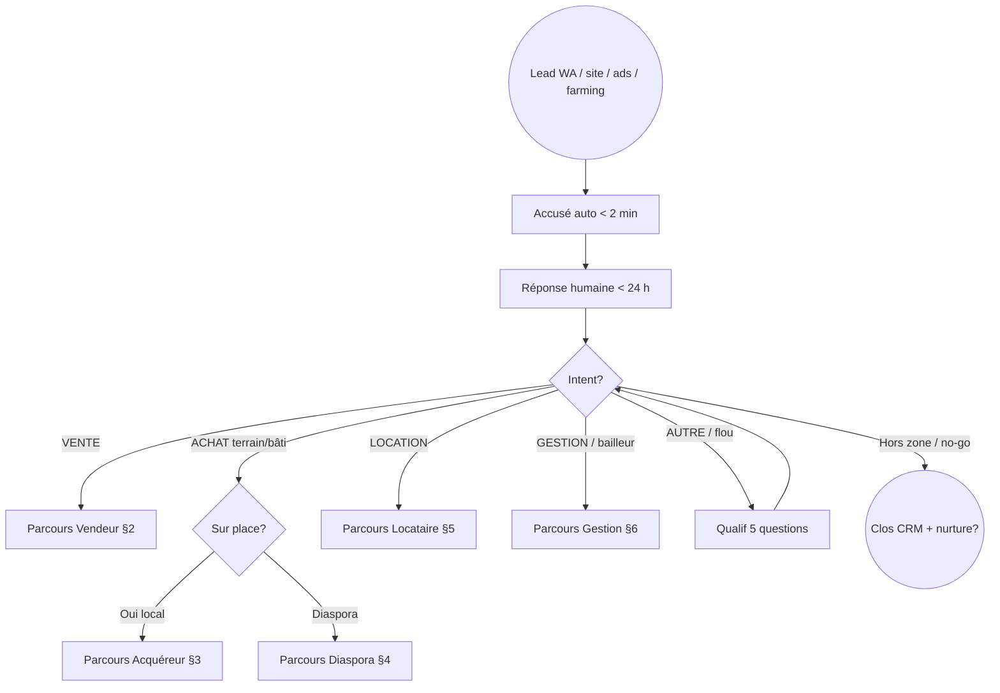
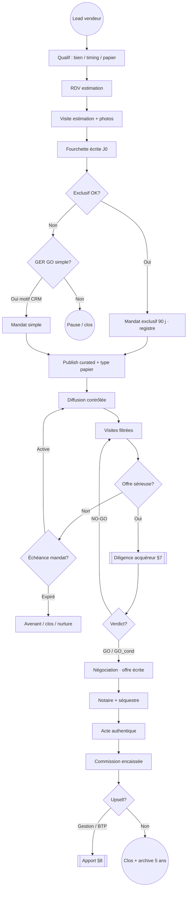
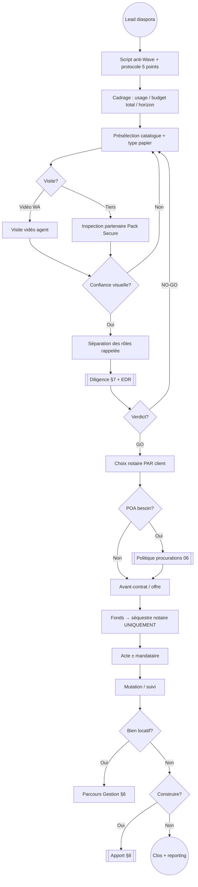
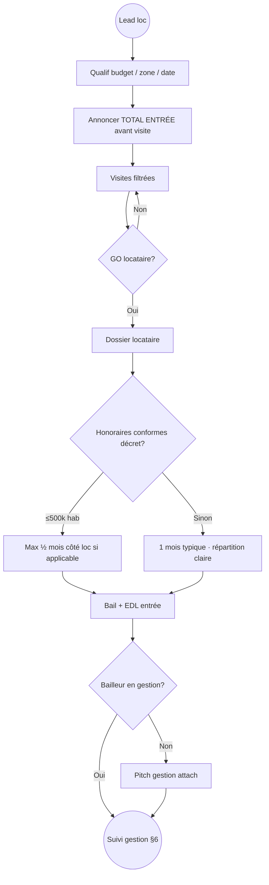
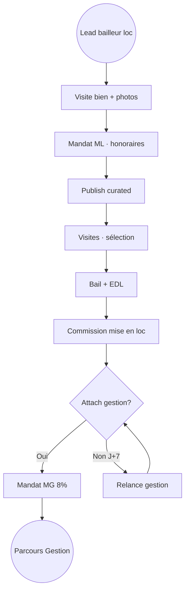
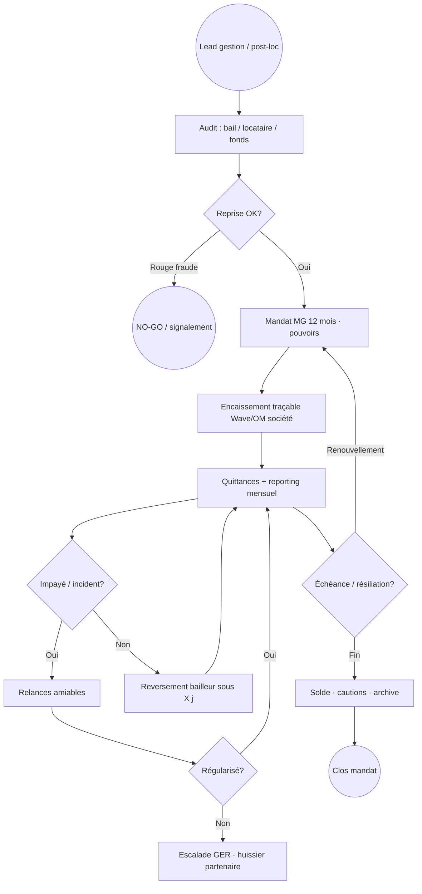
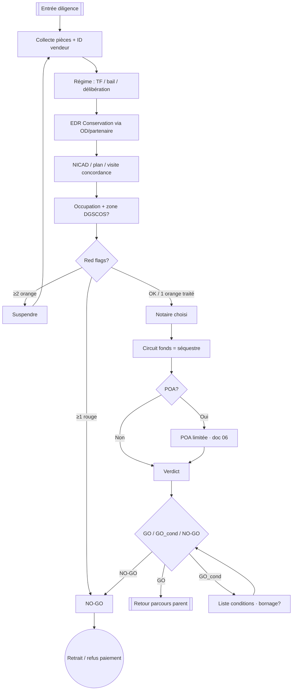
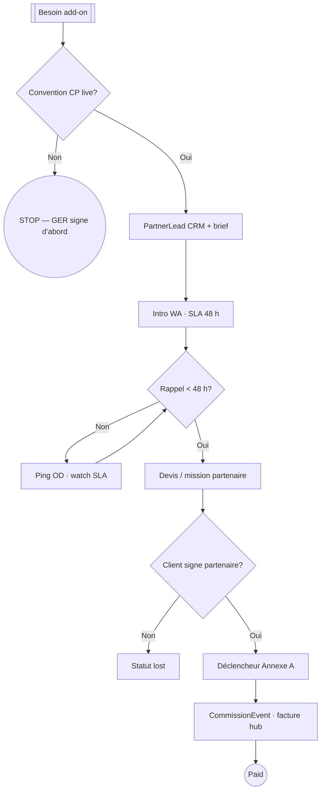
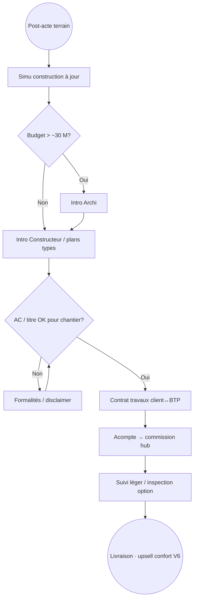
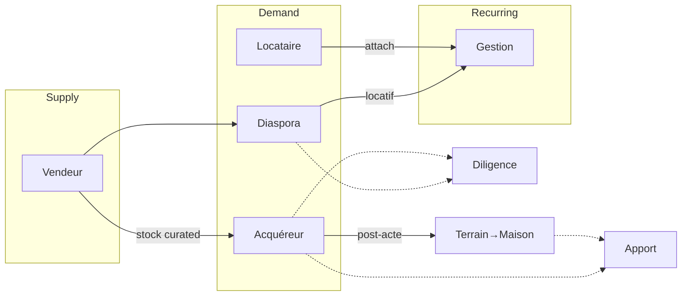

# Process par parcours — Flowcharts ops

**Document :** Dossier · Juridique & opérations · 04  
**Statut :** v1.0 — sept. 2026  
**Amont :** [`../etude-de-marche/02-analyse-demande.md`](../etude-de-marche/02-analyse-demande.md) · [`../../docs/hub-roadmap.md`](../../docs/hub-roadmap.md) · [`../offre-et-tarifs/03-packs-et-bundles.md`](../offre-et-tarifs/03-packs-et-bundles.md) · [`03-manuel-agent.md`](./03-manuel-agent.md) · [`02-convention-partenaire-type.md`](./02-convention-partenaire-type.md) · [`../risques-conformite/02-politique-anti-fraude.md`](../risques-conformite/02-politique-anti-fraude.md) · [`../etude-de-marche/06-parcours-foncier-securite.md`](../etude-de-marche/06-parcours-foncier-securite.md)  
**Aval :** CRM stages · formation · [`05-checklists-ops.md`](./05-checklists-ops.md)

---

## 0. Légende & règles

| Symbole | Sens |
| --- | --- |
| `[ ]` rectangle | Étape action |
| `{ }` losange | Décision / gate |
| `(( ))` cercle | Start / end |
| `[[ ]]` sous-process | Renvoi autre flowchart |

| Code couleur ops | |
| --- | --- |
| **Vert** | Passage autorisé |
| **Orange** | Frein / GO conditionnel |
| **Rouge** | Stop / NO-GO |
| **Bleu** | Handoff partenaire |

**Règles transverses (tous parcours) :**

1. SLA WA &lt; 24 h  
2. CRM à chaque stage  
3. **Jamais** Wave vendeur  
4. 1 rouge ou ≥ 2 orange → frein diligence  
5. Convention partenaire **avant** intro lead  

---

## 1. Router d’entrée (tous leads)



**Tags CRM :** `persona` · `intent` · `source` · `paper_interest`

---

## 2. Parcours **Vendeur** — Marième (supply)

*Outcome : mandat exclusif → closing → commission Axe 1.*  
*Vague : V0+ · bundle Vendre Mieux (V5 outils).*



| Stage CRM | Critère passage |
| --- | --- |
| `est_rdv` | Créneau confirmé |
| `est_done` | Fourchette envoyée |
| `mandat_actif` | Original signé + n° registre |
| `offre` | Offre écrite sous conditions |
| `closing` | Acte daté |
| `won` | Honoraires encaissés |

**KPI :** % exclusifs ≥ 60 % · reporting bi-mensuel tenu · délai mandat → closing.

---

## 3. Parcours **Acquéreur terrain / bâti** — Mamadou (P0)

*Outcome : décider (simus) → sécuriser → closer → option construire.*  
*Vague : V1 Décider · V2 Sécuriser.*

```mermaid
flowchart TD
  A((Lead achat)) --> B[Qualif budget / zone / terrain|bâti / délai]
  B --> C{Budget & zone OK?}
  C -->|Non| Z((Nurture / clos))
  C -->|Oui| D[Shortlist curated 2–4 biens]
  D --> E[Simus V1: mensualité + construction + total]
  E --> F{Client GO chiffres?}
  F -->|Non| E
  F -->|Oui| G[Visite terrain / bâti]
  G --> H[Feedback post-visite]
  H --> I{Intérêt fort?}
  I -->|Non| D
  I -->|Oui| J{Type papier?}
  J -->|Délibération / doute| K[CTA Pack Sécuriser / diligence]
  J -->|TF / bail clair| L[[Diligence §7]]
  K --> L
  L --> M{Verdict?}
  M -->|NO-GO| D
  M -->|GO_cond| N[Lever conditions · bornage?]
  N --> M
  M -->|GO| O[Offre sous conditions]
  O --> P[Notaire client · séquestre]
  P --> Q[Acte]
  Q --> R[Commission vente]
  R --> S{Veut construire?}
  S -->|Oui| T[[Apport BTP/Archi §8]]
  S -->|Non| U((Clos / upsell gestion si locatif))
```

| Gate | Bloquant |
| --- | --- |
| Avant acompte | Diligence mini + script anti-Wave |
| Avant boost listing | Policy papiers V2 si &gt; seuil |
| Avant chantier | Preuve AC / titre lisible (disclaimer sinon) |

---

## 4. Parcours **Diaspora** — Fatou / Ibrahima (P0)

*Outcome : preuve à distance → séquestre → acte / gestion.*  
*Vague : V2 + V4 Diaspora Secure. Aligné MyAfric 10 étapes (adapté hub).*



**5 rôles à séparer :** présentateur ≠ vérificateur ≠ notaire ≠ fonds ≠ mandataire POA.

**Interdits parcours :** photos seules = GO · Wave vendeur · cousin unique · POA générale.

---

## 5. Parcours **Location** — Aïssatou (demande) + mise en loc bailleur

### 5.1 Locataire



### 5.2 Bailleur — mise en loc seule



---

## 6. Parcours **Gestion locative** — Ousmane / Ibrahima



**Diaspora Ibrahima :** reporting renforcé (9–10 % ou forfait) · pas de cousin cash.

---

## 7. Sous-process **Diligence** (transverse)

*Réf. anti-fraude `02` · foncier `06` · Pack Sécuriser V2.*



| Qui | Rôle |
| --- | --- |
| AC | Spotter · collecter · freiner client |
| OD | EDR · partenaires · tracker |
| GER | A sur verdict sensible |
| Formalités / notaire / géomètre | Exécution |

---

## 8. Sous-process **Apport partenaire**



---

## 9. Parcours **Terrain → Maison** (post-closing Mamadou)



---

## 10. Carte parcours × persona × vague

| ID | Parcours | Persona | Vague min | Bundle |
| --- | --- | --- | ---: | --- |
| P0 | Router | Tous | V0 | Agence Live |
| P1 | Vendeur | Marième | V0 | Vendre Mieux (V5) |
| P2 | Acquéreur | Mamadou · JP | V1 | Décider + Sécuriser |
| P3 | Diaspora | Fatou · Ibrahima | V2/V4 | Diaspora Secure |
| P4 | Location | Aïssatou · bailleur | V0/V3 | Louer & Gérer |
| P5 | Gestion | Ousmane · Ibrahima | V3 | Louer & Gérer |
| P6 | Diligence | Transverse | V2 | Sécuriser |
| P7 | Apport | Transverse | V1 | Partner-led |
| P8 | Terrain→Maison | Mamadou | V1+ | Soft pack |



---

## 11. Stages CRM unifiés (proposition Y1)

| Stage | Libellé | Parcours typiques |
| --- | --- | --- |
| `new` | Lead entrant | Tous |
| `qualified` | Intent + budget | Tous |
| `appointment` | RDV / visite calée | P1–P4 |
| `proposal` | Estimation / offre / simu | P1–P3 |
| `mandate` | Mandat signé | P1, P4b, P5 |
| `diligence` | Vérif en cours | P2, P3, P6 |
| `negotiation` | Offre / contre | P1–P3 |
| `notary` | Séquestre / acte | P1–P3 |
| `won` | Encaissé | Tous $ |
| `nurture` | Pause active | Tous |
| `lost` | Clos négatif | Tous |

**PartnerLead stages :** `sent` → `recalled` → `quoted` → `signed` → `commission_due` → `paid`.

---

## 12. Temps cibles (ordres de grandeur)

| Transition | Cible hub |
| --- | --- |
| Lead → 1ʳᵉ réponse humaine | &lt; 24 h (5 h chaud) |
| Qualif → RDV visite | &lt; 72 h |
| Estimation → mandat (chaud) | &lt; 7 j |
| Offre → diligence lancée | &lt; 48 h |
| Rappel partenaire | &lt; 48 h |
| Diligence EDR (si pièces OK) | jours–semaines (external) |
| Compromis/offre → acte SN | semaines–mois (notaire) |

*Ne pas promettre des délais État (mutation, AC) irréalistes.*

---

## 13. Sources

### Internes

| Doc | Usage |
| --- | --- |
| [`02-analyse-demande.md`](../etude-de-marche/02-analyse-demande.md) | 7 personas |
| [`hub-roadmap.md`](../../docs/hub-roadmap.md) | 1 parcours / vague |
| [`03-packs-et-bundles.md`](../offre-et-tarifs/03-packs-et-bundles.md) | Bundles outcome |
| [`03-manuel-agent.md`](./03-manuel-agent.md) | Actions terrain |
| [`02-politique-anti-fraude.md`](../risques-conformite/02-politique-anti-fraude.md) | Gates diligence |
| [`06-parcours-foncier-securite.md`](../etude-de-marche/06-parcours-foncier-securite.md) | Checklist EDR |

### Externes

| Source | Insight |
| --- | --- |
| Maline — pipeline mandats | 7 étapes détection → compromis · critères de passage |
| MyAfric — achat SN / diaspora | 8–10 étapes · séparation des rôles · séquestre |
| SenPages / DGID circuit terrain | EDR → notaire → mutation = propriété |
| ImmoLudivine — 7 étapes diaspora 2026 | Notaire choisi · POA · pas de Wave |
| Paperasse workflow vente (FR analogie) | Phases avant-contrat → acte (adapter SN) |

---

*Process par parcours v1.0 — sept. 2026. Mermaid viewable GitHub / Notion. Prochain : `05-checklists-ops.md`.*
