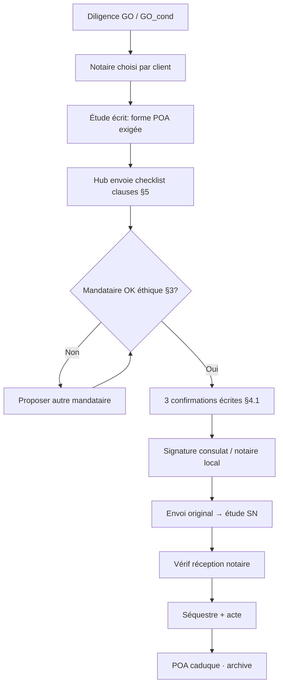

# Politique procurations — Cadre POA diaspora

**Document :** Dossier · Juridique & opérations · 06  
**Statut :** v0.1 **BROUILLON** — sept. 2026  
**⚠ Relecture avocat + validation étude notariale SN avant modèles clients**  
**Amont :** [`../risques-conformite/02-politique-anti-fraude.md`](../risques-conformite/02-politique-anti-fraude.md) · [`04-process-par-parcours.md`](./04-process-par-parcours.md) §4 · [`03-manuel-agent.md`](./03-manuel-agent.md) · [`../../docs/add-ons/specs/05-diaspora-confiance/37-procuration-assist.md`](../../docs/add-ons/specs/05-diaspora-confiance/37-procuration-assist.md) · [`../offre-et-tarifs/03-packs-et-bundles.md`](../offre-et-tarifs/03-packs-et-bundles.md)  
**Aval :** Pack Diaspora Secure (V4) · blog D2 · formation AC · notaire partenaire

---

## 0. Avertissement

> Cette politique cadre le **comportement hub** et les **exigences minimum** d’une procuration.  
> Elle **ne remplace pas** un acte notarié / consulaire. La forme exacte (apostille, légalisation, traduction) est fixée par l’**étude SN** + autorités du pays de signature.  
> En cas de conflit trame ↔ notaire / avocat : **le professionnel du droit prime**.

**Rôle hub :** *assister, checklist, orienter* — **pas** rédiger seul une POA « maison » présentée comme authentique.

---

## 1. Principes non négociables

| # | Règle |
| --- | --- |
| **1** | **Spéciale** (acte / bien déterminés) — **jamais** générale illimitée sur conseil hub |
| **2** | **Prix plafond** chiffré (FCFA) · frais inclus ou exclus **explicitement** |
| **3** | **Durée courte** datée (cible **3–6 mois**, max **12** si notaire OK) · fin auto à l’acte |
| **4** | **Bien désigné** : adresse · réfs titre/bail/NICAD · pas « bien équivalent » |
| **5** | **Séparation des rôles** : mandataire POA ≠ présentateur bien ≠ vérificateur ≠ détenteur fonds |
| **6** | Fonds → **séquestre notaire** — la POA ne permet **pas** Wave vendeur |
| **7** | Mandataire = ID connue · contact direct client↔notaire |
| **8** | Révocation écrite possible · stub déposé chez notaire SN |
| **9** | Forme exigée **par écrit** par l’étude SN **avant** signature à l’étranger |
| **10** | Agent hub **n’est pas** mandataire POA par défaut (conflit d’intérêt) — exception GER rare + clauses |

**Promesse client :** *Une bonne procuration se reconnaît à ses limites.* (MyAfric)

---

## 2. Quand une POA est nécessaire

| Situation | POA ? |
| --- | --- |
| Client diaspora ne peut pas venir signer l’acte / avant-contrat | **Oui** |
| Client vient pour l’acte final seulement | Souvent **non** (ou POA limitée étape intermédiaire) |
| Gestion locative / EDL / signature bail | Mandat gestion `01` ± POA **distincte** (pas mélanger avec achat) |
| Vendeur représenté | Vérifier **sa** POA (authenticité · bien nommé) — red flag si opaque |

**Gate parcours diaspora (`04`) :** diligence GO → choix notaire → **puis** POA si besoin → séquestre → acte.

---

## 3. Qui peut être mandataire (shortlist éthique)

| Profil | Hub |
| --- | --- |
| Proche de confiance **≠** vendeur / présentateur du bien | OK si clauses §5 |
| Collaborateur / avocat désigné | OK · traçabilité |
| Agent hub / gérant | **Défaut NON** — conflit (présentateur + signataire) |
| Vendeur / cousin qui « trouve et signe » | **Interdit** |
| Chaîne de sous-mandats | **Interdit** (pas de substitution sauf clause expresse refusée par défaut) |

**Rappel MyAfric :** 5 fonctions séparées — présentateur · vérificateur · notaire · fonds · mandataire.

---

## 4. Voies de forme (indicatif — confirmer dossier par dossier)

*Coûts / délais marché 2025–2026 — ordres de grandeur, pas devis.*

| Voie | Pour qui | Coût indicatif | Délai typ. | Notes |
| --- | --- | ---: | --- | --- |
| **Consulat SN** (ex. Paris — décret 65) | Ressortissants / actes destinés SN | Souvent **gratuit** | RDV + immédiat à signature | Acte dressé / authentifié selon pratique consulaire · **présence mandant** · modèle souvent fourni par notaire SN |
| **Notaire pays de résidence** (FR, etc.) + formalités | Tous | ~150–300 € + légalisation/apostille | 7–15 j+ | Forme à aligner sur exigences étude SN |
| **Notaire SN** (mandant en visite) | Séjour SN | Selon étude | Court | Idéal si déplacement possible |

### 4.1 Méthode « 3 confirmations écrites » (MyAfric)

Avant de faire signer quoi que ce soit à l’étranger, obtenir **par écrit** :

1. **Étude notariale SN** — forme exigée · traduction ? · durée max acceptée  
2. **Représentation SN** (consulat/ambassade) — peut-elle établir / authentifier ? délais  
3. **Autorité locale** (notaire FR / notary public…) — ce qu’elle peut délivrer pour usage SN  

Si les 3 ne se recoupent pas → **ne pas improviser** · escalade OD / notaire partenaire.

### 4.2 Envoi physique

- [ ] Original (pas seul scan) vers étude SN / mandataire  
- [ ] Courrier suivi / remise main propre traçable  
- [ ] Copie certifiée coffre CRM hub  
- [ ] ID mandant + mandataire jointes  

---

## 5. Clauses obligatoires (checklist rédaction)

*À faire figurer dans le projet d’acte — avocat/notaire.*

| Clause | Pourquoi | Si absente |
| --- | --- | --- |
| **Objet limité** à un/des actes nommément (offre, acte, formalités) | Évite chèque en blanc | Mandataire peut tout faire |
| **Bien identifié** (adresse, TF/bail/NICAD) | Pas de substitution | « Bien équivalent » |
| **Prix plafond** FCFA (+ frais : inclus/exclus) | Plafond d’engagement | Surenchère silencieuse |
| **Durée** date de fin **ou** « jusqu’à acte puis caduc » | Expire seule | POA zombie des années |
| **Paiement uniquement** séquestre / compte notaire nommé | Anti-Wave | Contournement fonds |
| **Exclusion disposition** : pas revente, hypothèque, donation, bail long sans nouvel accord | Protège post-achat | Bien engagé aussitôt |
| **Pas de substitution** / sous-mandat (défaut) | Contrôle | Chaîne opaque (orange O4) |
| **Compte-rendu** écrit au mandant (jalons) | Transparence | Ghosting |
| **Révocation** possible par écrit + notification étude | Frein d’urgence | Impossible de stopper |
| **Notaire désigné** ou shortlist | Évite notaire vendeur imposé | Perte contrôle |

### 5.1 Pouvoirs typiquement **inclus** (achat)

- Comparaître pour signature offre / acte sur le bien désigné  
- Remettre pièces · recevoir notifications  
- Faire diligences (EDR, etc.) via professionnels  
- Donner quitus dans la limite du plafond  

### 5.2 Pouvoirs typiquement **exclus**

- Payer le vendeur hors séquestre  
- Modifier le prix au-delà du plafond  
- Acquérir un autre bien  
- Hypothéquer / revendre / donner  
- Engager des travaux / acomptes BTP (sauf avenant POA chantier distinct)  
- Ouvrir compte perso au nom du mandant sans instruction  

---

## 6. Process hub (ops)



| Étape | AC | OD | GER | Notaire |
| --- | :---: | :---: | :---: | :---: |
| Détecter besoin POA | R | C | I | — |
| Exiger forme écrite étude | C | R | I | A |
| Checklist clauses | R | A | I | C |
| Valider mandataire | C | R | **A** si doute | C |
| Suivi envoi original | C | R | I | R réception |
| Acte | I | C | I | **A/R** |

---

## 7. Monétisation & packs

| Offre | Contenu POA | Tarif hub |
| --- | --- | ---: |
| **Diaspora Secure** (V4) | Protocole + orientation ; assist POA souvent **option** | Pack **300–800 k** |
| **Assist procuration** à la carte | Checklist · coordination consulat/notaire · suivi envoi | **100–250 k** (ou inclus Secure selon devis) |
| **Diaspora Full** | Secure + séquestre + … | Sur devis |
| Honoraires notaire / consulat | Hors hub | Client direct |

Hub facture l’**orchestration**, pas l’acte authentique.

---

## 8. Scripts WhatsApp

### 8.1 Expliquer le besoin

```
Pour signer sans venir, il faut une procuration SPÉCIALE :
bien nommé, prix plafond, durée courte, paiement uniquement chez le notaire.
On ne recommande jamais une procuration générale « pour tout gérer ».
Je vous envoie la checklist ; le notaire fixe la forme exacte.
```

### 8.2 Refus cousin unique

```
Même si c’est un proche : celui qui présente le bien ne doit pas
être le seul à vérifier, encaisser et signer.
On sépare les rôles — c’est non négociable pour votre sécurité.
```

### 8.3 Agent pas mandataire

```
Notre agence orchestre et suit le dossier ; en principe on n’est pas
votre mandataire de signature (conflit d’intérêt).
On vous aide à désigner un mandataire et à cadrer l’acte avec le notaire.
```

---

## 9. Red flags POA (stop / frein)

| Signal | Action |
| --- | --- |
| POA générale « tous biens / tous actes » | **Refus** accompagner jusqu’à POA spéciale |
| Pas de plafond prix | Frein |
| Durée indéterminée / &gt; 12 mois sans raison | Frein · demander étude |
| Mandataire = vendeur ou présentateur | **Stop** |
| Droit de substitution libre | Frein |
| Scan WhatsApp seul, pas d’original | Frein jusqu’à original |
| Chaîne de POA | Orange ×2 → suspendre |
| POA qui autorise paiement vendeur direct | **Stop** (anti-fraude) |

---

## 10. Checklist agent (copier CRM)

**Avant signature POA à l’étranger**

- [ ] Diligence parent dossier ≠ NO-GO  
- [ ] Notaire SN nommé · contact client direct  
- [ ] Forme exigée **écrite** par l’étude  
- [ ] Mandataire ≠ vendeur / présentateur / hub (sauf GER)  
- [ ] Projet d’acte contient clauses §5 (plafond, bien, durée, séquestre, exclusions)  
- [ ] 3 confirmations §4.1 ou écart documenté GER  
- [ ] Client a lu script anti-Wave  
- [ ] Option tarif assist POA / pack Secure claire  

**Après signature**

- [ ] Original expédié / remis · tracking  
- [ ] Accusé réception étude  
- [ ] Scan coffre CRM  
- [ ] Date fin POA dans CRM `poa_expires_at`  
- [ ] Révocation process briefé au client  

**Post-acte**

- [ ] Confirmer caducité / restitution  
- [ ] Archive 5 ans  

---

## 11. Variantes

| Variante | Traitement |
| --- | --- |
| **Vente** (Marième diaspora vendeuse) | POA spéciale vente · prix **plancher** + bien · pas général |
| **Bail / gestion** | Mandat MG `01` prioritaire ; POA séparée si signature distante |
| **Chantier** | POA **distincte** (acomptes BTP plafonnés · jalons) — jamais glissée dans POA achat |
| **Indivision / couple** | Tous mandants présents / co-POA selon régime matrimonial — avocat |
| **USA / Canada / UK** | Notary local + apostille/légalisation selon pays · confirmer étude SN |

---

## 12. Données CRM (cible)

```
PoaCase {
  dealId, clientId,
  mandataireName, mandataireIdDoc,
  notaryId,
  formPath: consular | foreign_notary | sn_notary,
  clausesChecklist: boolean,
  priceCapFcfa, propertyRefs, expiresAt,
  originalSentAt, notaryReceivedAt,
  status: draft | signed | received | used | revoked | expired
}
```

---

## 13. Gouvernance & formation

| Règle | |
| --- | --- |
| Modèles types | Uniquement après paraphe avocat + 1 étude partenaire |
| Exception hub = mandataire | GER + avocat · dossier écrit |
| Quiz J1 agents | 5 clauses obligatoires + séparation des rôles |
| Incident POA (abus) | Déclaration &lt; 24 h · stop dossier |

---

## 14. Sources

### Internes

| Doc | Usage |
| --- | --- |
| [`02-politique-anti-fraude.md`](../risques-conformite/02-politique-anti-fraude.md) | Règles diaspora · interdits |
| [`04-process-par-parcours.md`](./04-process-par-parcours.md) | Flow diaspora |
| [`05-checklists-ops.md`](./05-checklists-ops.md) | Gate paiement / acte |
| [`37-procuration-assist.md`](../../docs/add-ons/specs/05-diaspora-confiance/37-procuration-assist.md) | Add-on produit |
| [`03-notaire.md`](../../docs/partenaires/specs/02-juridique-admin/03-notaire.md) | Partenaire closing |
| [`02-grille-tarifs.md`](../offre-et-tarifs/02-grille-tarifs.md) | 100–250 k assist |

### Externes

| Source | Insight |
| --- | --- |
| MyAfric — procuration achat SN | Clauses bornées · 3 confirmations forme · pas de procédure figée publique |
| Investissement Immo Afrique — guide POA 2026 | Consulaire vs notarié FR · coûts · spéciale vs générale |
| Consulat SN Paris — service juridique | Procuration · pièce ID · présence mandant · gratuit · modèle notaire |
| Notaires FR — actes pour l’étranger | Apostille / légalisation selon destination |
| ImmoLudivine / SenPages diaspora | POA + séquestre · pas de paiement avant vérif |

---

*Politique procurations v0.1 brouillon — sept. 2026. Pack juridique-operations 01–06 complet. Ne pas diffuser modèle d’acte client sans paraphe avocat.*
